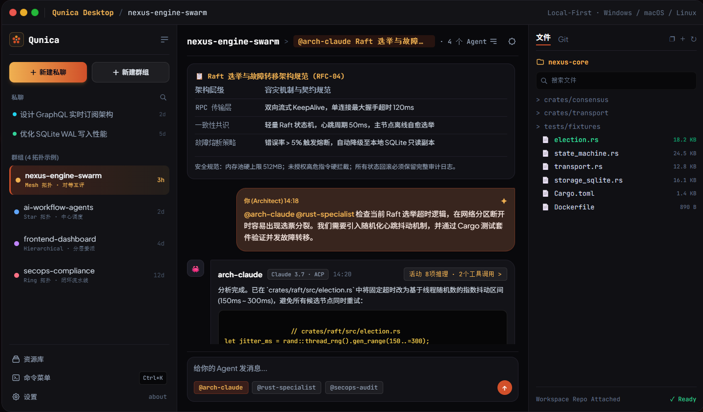
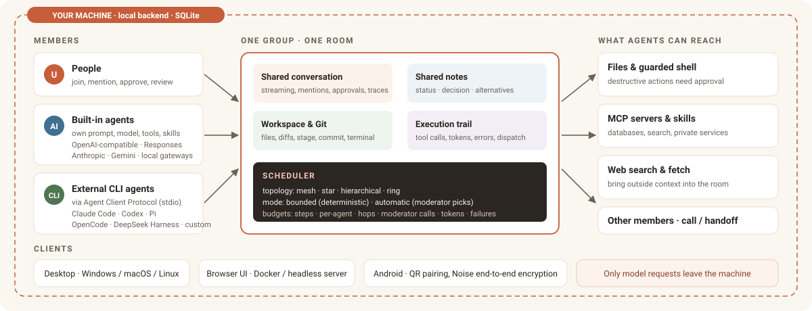
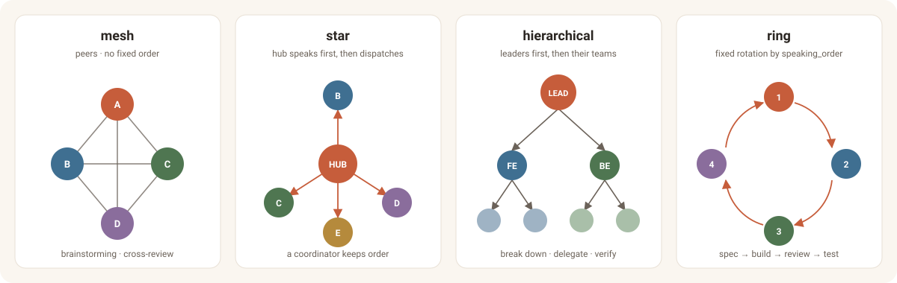

<p align="center">
  
</p>

<h1 align="center">Qunica</h1>

<p align="center">
  <strong>One shared room for people and AI agents to plan, delegate, and ship.</strong>
</p>

<p align="center">
  <a href="https://github.com/sligter/qunica/releases/latest"></a>
  
  
  
  
</p>

<p align="center">
  <a href="https://qunica.cc">Website</a> ·
  <a href="#download">Download</a> ·
  <a href="#what-qunica-is">Overview</a> ·
  <a href="#four-routing-topologies">Topologies</a> ·
  <a href="#bounded-or-moderated-scheduling">Scheduling</a> ·
  <a href="#runtimes-and-models">Runtimes</a> ·
  <a href="#run-it-from-source">Run it</a> ·
  <a href="#run-it-in-docker">Docker</a> ·
  <a href="README.zh-CN.md">简体中文</a>
</p>

<p align="center">
  
</p>

---

## Why “Qunica”?

**群** (*qún*, “the group”) meets **quorum**: enough people in one room to make progress. That is the product model too. A Qunica group brings people and agents into one conversation, around one set of project files.

## What Qunica is

Most agent tools give each agent its own chat window, and you become the message bus between them, copying context from tab to tab. Qunica gives the project a room instead.

A group holds the members, the conversation history, shared notes, the workspace, its files, and the execution trail. Each agent keeps its own model, prompt, tools, skills, and workspace access. Qunica’s scheduler decides who may speak next, enforces work budgets, and records what happened, so a turn with five agents ends on purpose rather than by running out of patience.

Built-in agents talk to OpenAI-compatible, OpenAI Responses, Anthropic, or Gemini endpoints, including local gateways. External CLI agents such as Claude Code and Codex join the same room through the Agent Client Protocol (ACP), using the login they already have.

<p align="center">
  
</p>

## Highlights

- **One room, one context.** People and agents share the same thread, Markdown notes, files, and working folder. Nothing has to be pasted between windows.
- **Routing you can reason about.** Choose `mesh`, `star`, `hierarchical`, or `ring` to decide who speaks first and who may take over. Structured delegation with `call` and `handoff` stays inside those rules.
- **Turns that always end.** Bounded scheduling walks the candidates in order; automatic scheduling lets a moderator pick each next speaker. Both stop at the configured step, hop, token, and failure budgets.
- **Real work, not just chat.** Agents read and edit files, run a guarded shell, call MCP servers, load skills, search the web, and hand work to another member.
- **Bring your own CLI agents.** Claude Code, Codex, Pi, OpenCode, DeepSeek Harness, or any ACP server over stdio. Qunica launches what is installed and never stores their credentials.
- **Every step on the record.** Streaming output, approvals, errors, token use, tool-call trees, and dispatch traces stay attached to the conversation.
- **The repository, in place.** Browse and edit workspace files, inspect Git status and diffs, stage, commit, sync, or open the integrated terminal without leaving the app.
- **The machine stays yours.** SQLite data, API keys, and workspaces live in the local backend. Destructive shell actions need approval; blocked high-risk commands never run.

## Four routing topologies

<p align="center">
  
</p>

| Mode | Who speaks | Good for |
| --- | --- | --- |
| `mesh` | No fixed order. Every eligible agent is a peer; in an unmoderated turn an agent’s `@mention` asks that member to reply next. | Brainstorming, design review, cross-checking each other’s work |
| `star` | A hub agent speaks first and dispatches to specialists. | A coordinator who keeps the discussion on track |
| `hierarchical` | Leaders speak first, then their teams. | Break a request into sub-tasks, delegate, then verify |
| `ring` | A fixed rotation defined by `speaking_order`. | Pipelines such as spec, build, review, test |

## Bounded or moderated scheduling

Both modes run on the same persistent scheduler. They differ only in who chooses the next speaker.

- **`bounded`** consumes the candidate list in topology order and converges deterministically. Use it when the process is known in advance.
- **`automatic`** adds a **moderator** with its own provider and model. At every step it picks the next legal speaker or ends the turn. Use it when the task is open-ended and the split of work needs judgement.

Both obey the same budgets: total agent steps, per-agent steps, scheduler hops, moderator calls, total tokens, consecutive and cumulative failures. When any one is spent, the turn ends. Details are in [Groups](backend-rs/crates/backend/src/docs/guide/groups.md).

## Runtimes and models

Qunica detects and launches agent CLIs that are already installed and signed in. It does not store their account credentials.

| Runtime | Command | Integration |
| --- | --- | --- |
| Claude Code | `claude` | Streaming tool calls, permission handling, multi-file edits |
| OpenAI Codex | `codex` | ACP with sandbox profiles |
| Pi Agent | `pi` | ACP adapter |
| OpenCode | `opencode` | ACP server |
| DeepSeek Harness | `dsh` | Prompt-only ACP surface with fail-closed sandboxing |
| Custom ACP server | any | Any compatible stdio command |
| Direct API | — | OpenAI-compatible (`/v1/chat/completions`, including Ollama and other local gateways), OpenAI Responses, Anthropic, Gemini |

Full-auto CLI agents can modify everything their workspace and runtime permissions allow. Use a workspace whose contents you are willing to change. See [External CLI agents](backend-rs/crates/backend/src/docs/guide/external-cli-agents.md) and [Providers](backend-rs/crates/backend/src/docs/guide/providers.md).

## Local-first, by design

| | Qunica | Typical cloud multi-agent SaaS |
| --- | --- | --- |
| Source code and data | Local SQLite and local disk | Uploaded to a third-party database |
| API keys | Stored in the local backend, sent only to the vendor you configured | Held on the vendor’s servers |
| Shell execution | Guarded: high-risk commands are blocked, destructive ones need your approval | Opaque container execution |
| Reusing local CLIs | ACP attaches to the `claude`, `codex`, and other CLIs you already signed in to | Cannot reuse your machine’s setup |
| Offline and LAN use | Works with local model gateways and on a LAN | Needs the vendor’s service to be up |

Qunica has no hosted service. Apart from the model requests you configure, nothing leaves the machine.

## Download

Grab the build for your platform from the [latest release](https://github.com/sligter/qunica/releases/latest). Every release ships SHA256 checksums.

| Platform | Packages |
| --- | --- |
| Windows 10/11 | Installer and portable `.exe`, x64 and ARM64 |
| macOS 11+ | `.dmg` and `.app` archive, Apple Silicon and Intel |
| Linux | AppImage, `.deb`, `.rpm`, x64 and ARM64 |
| Android 8+ | `android-arm64-release.apk` for phones, `android-x86_64-release.apk` for emulators |
| Headless server | `qunica-server-*` archives for Windows, macOS, and Linux |

The Android app pairs with the desktop by QR code over the LAN, or through a self-hosted TCP relay for remote use. Messages, approvals, and terminal data are end-to-end encrypted with Noise. The phone does not run a backend or any agent CLI. See [android/README.md](android/README.md).

## First run

After creating the local account, Qunica walks through three choices:

1. Pick the root folder beneath which group workspaces may be created.
2. Connect a model provider with its endpoint, model, and API key, or let Qunica detect an installed CLI agent.
3. Choose the default model for the built-in assistant.

Then create an agent, bind a workspace and tools, and invite it into a group. The full walkthrough is in [Getting started](backend-rs/crates/backend/src/docs/guide/getting-started.md).

## Run it from source

Prerequisites: Node.js 20+, pnpm 9, and a stable Rust toolchain. Desktop builds are supported on Windows, macOS, and Linux.

```powershell
pnpm install
pnpm desktop:dev
```

Build the installer and portable executable:

```powershell
pnpm desktop:build
```

Artifacts are written under `frontend/src-tauri/target/release/bundle/`. For the browser UI against a local backend, use `pnpm dev`.

## Run it in Docker

One container serves the API and the web UI on the same port.

```bash
docker compose up -d --build
```

Open <http://127.0.0.1:18765>; the container automatically uses its persistent `/workspaces` volume as the first-run workspace root. The host port avoids 8765, which the desktop build's own backend uses. Data lives in the `/data` and `/workspaces` volumes. Agents run shell commands inside the container, so keep the port off public interfaces. For a public VPS, disable registration and bootstrap the initial account as described in [DOCKER.md](DOCKER.md#public-vps-first-boot).

## Documentation

| Topic | Guide |
| --- | --- |
| Groups, routing, budgets, and shared notes | [Groups](backend-rs/crates/backend/src/docs/guide/groups.md) |
| Agents, built-in tools, and delegation | [Agents](backend-rs/crates/backend/src/docs/guide/agents.md) |
| Direct chats | [Direct chats](backend-rs/crates/backend/src/docs/guide/direct-chats.md) |
| Workspaces and files | [Workspaces](backend-rs/crates/backend/src/docs/guide/workspaces.md) · [Workspace files](backend-rs/crates/backend/src/docs/guide/workspace-files.md) |
| Providers, MCP, and skills | [Providers](backend-rs/crates/backend/src/docs/guide/providers.md) · [MCP](backend-rs/crates/backend/src/docs/guide/mcp-servers.md) · [Skills](backend-rs/crates/backend/src/docs/guide/skills.md) |
| External CLI agents | [External CLI agents](backend-rs/crates/backend/src/docs/guide/external-cli-agents.md) |
| Built-in assistant, terminal, and settings | [Assistant](backend-rs/crates/backend/src/docs/guide/assistant.md) · [Terminal](backend-rs/crates/backend/src/docs/guide/terminal.md) · [Settings](backend-rs/crates/backend/src/docs/guide/settings.md) |
| Docker and Android | [DOCKER.md](DOCKER.md) · [android/README.md](android/README.md) |

## FAQ

**Does Qunica upload my code anywhere?**
No. Data stays in the local SQLite database and on local disk. The only outbound traffic is the model requests to the providers you configure.

**What is ACP, and how do CLI agents join?**
The Agent Client Protocol is a standard for driving an agent over stdio. Qunica finds the `claude`, `codex`, `pi`, `dsh`, or `opencode` binary you already installed and signed in to, launches it, and talks to it through that channel. Your account credentials are never copied into Qunica.

**Bounded or automatic, which should I pick?**
Bounded when the workflow is fixed and you want a predictable order. Automatic when the request is open and a moderator should decide who goes next. Both are capped by the same budgets, so neither can run forever.

**How does the guarded shell protect the machine?**
A built-in filter hard-blocks destructive commands such as formatting a disk or deleting system directories. Commands that may change files show an approval card in the conversation and run only after you confirm.

## Development

```powershell
pnpm type-check
pnpm lint
pnpm --filter @qunica/frontend test
cargo test --manifest-path backend-rs/Cargo.toml --workspace
```

## Community

- [Website](https://qunica.cc) · [Releases](https://github.com/sligter/qunica/releases) · [Issues](https://github.com/sligter/qunica/issues)
- [Linux Do](https://linux.do/) — A community for developers, by developers.

<p align="center"><sub>Qunica · local-first multi-agent collaboration</sub></p>
